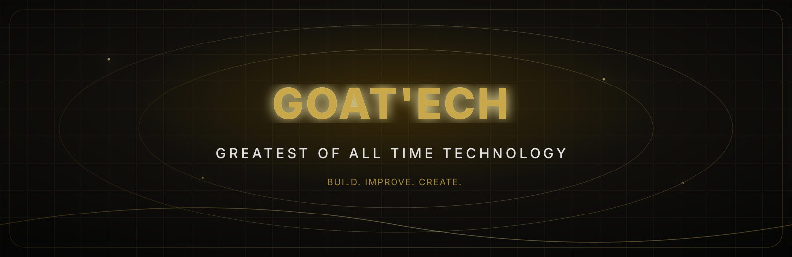
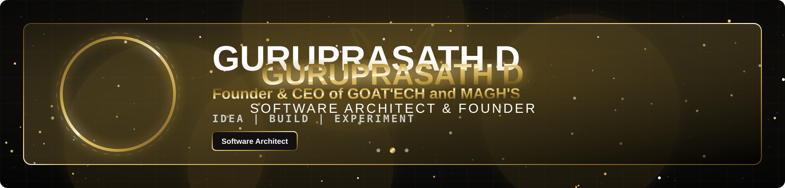
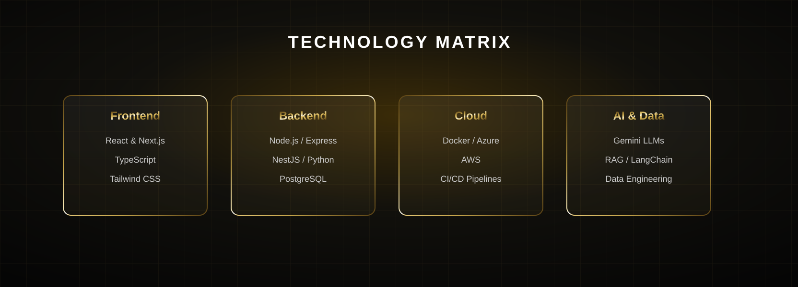
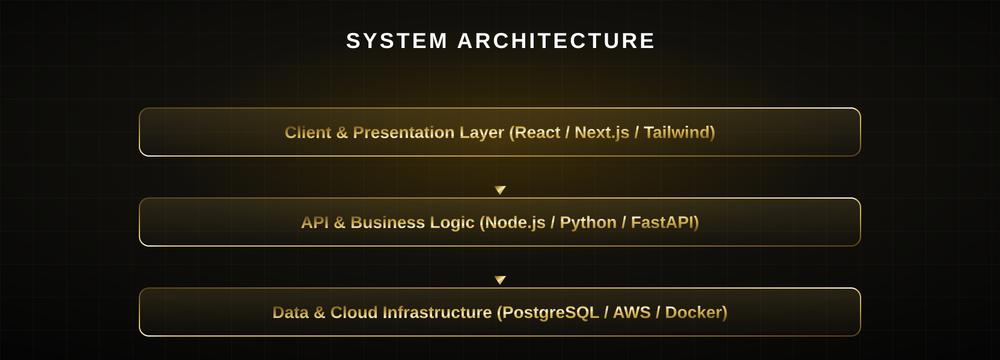

 

---

  
   
  
   
  
   
  

---

  
   
  

### What I focus on

---

---

---

 
 
 
 
 
 
 
 

---

---

---

  

<!-- ========================================================= -->
<!--                     PREMIUM HERO                          -->
<!-- ========================================================= -->

  

<!-- ========================================================= -->
<!--                    PROFILE INTRO                          -->
<!-- ========================================================= -->

 

<!-- ========================================================= -->
<!--                    TECHNOLOGY MATRIX                      -->
<!-- ========================================================= -->

  

<!-- ========================================================= -->
<!--                    LANGUAGE WALL                          -->
<!-- ========================================================= -->

  

<!-- ========================================================= -->
<!--                  ARCHITECTURE                             -->
<!-- ========================================================= -->

  

<!-- ========================================================= -->
<!--                  CONTRIBUTION GRAPH                       -->
<!-- ========================================================= -->

  

